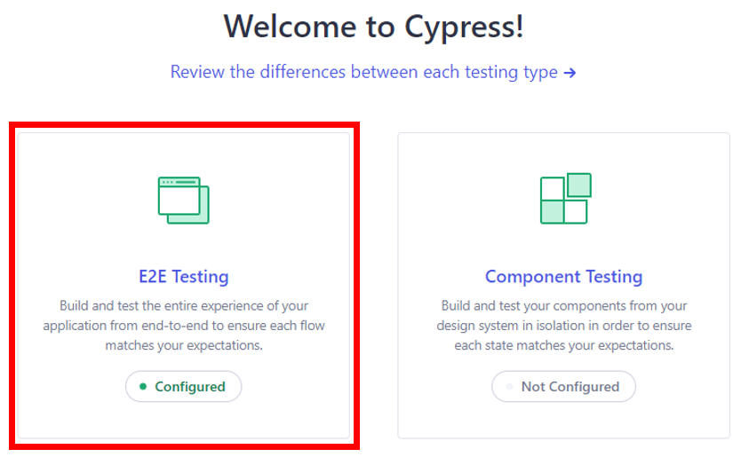
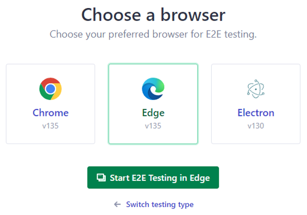

# 🐵 Monkey Web - Cypress

## 📌 Descripción
Testing al sitio web [losestudiantes.co](https://losestudiantes.co) que simula interacciones aleatorias de usuario mediante la técnica de monkey testing.

## 🚀 Características

Realiza una acción al azar sobre un elemento existente en la página:
- ✔️ Hacer click en un link al azar
- ✔️ Llenar un campo de texto al azar
- ✔️ Seleccionar un combo al azar
- ✔️ Hacer click en un botón al azar

## ⚙️ Instalación
```bash
git clone https://github.com/leonelparrales22/monkey-web.git
cd monkey-testing
npm install cypress --save-dev
```

## ⚙️ Instalación dependencias

```bash
npm install
```

## 🖥️ Abrir la interfaz gráfica

Para abrir la interfaz gráfica de Cypress, ejecutar el siguiente comando en la terminal:

```bash
npx cypress open
```

## 📂 Ubicación de la prueba programada

Seleccionar E2E Testing



Seleccionar un navegador y dar click en "Star"



El archivo de prueba Monkey que se configuró se encuentra ubicado en la ruta e2e/monkey_testing_personal.cy.js

```bash
e2e/monkey_testing_personal.cy.js
```

Al seleccionar el archivo monkey_testing_personal.cy.js, se iniciará la prueba:


## 📊 Aspectos Técnicos

1. Se carga la página y se verifica que todos los componentes estén disponibles para iniciar la prueba.

```javascript
describe("Los estudiantes under monkeys", function () {
  it("visits los estudiantes and survives monkeys", function () {
    cy.visit("https://losestudiantes.co").then(() => {
      cy.get("body").should("be.visible");
      cy.get("a, button, input, select")
        .should("exist")
        .then(() => {
          cy.wait(1000).then(() => {
            randomEvent(10);
          });
        });
    });
  });
});
```

2. Se define una función para generar números aleatorios dentro de un intervalo específico, y se implementa una condición para detener la ejecución cuando se agoten los intentos (monkeys).


```javascript
  function obtenerNumeroRandom(min, max) {
    min = Math.ceil(min);
    max = Math.floor(max);
    return Math.floor(Math.random() * (max - min)) + min;
  }

  var monkeysLeft = monkeysLeft;

  if (monkeysLeft <= 0) {
    console.log("No existen monkeys para ejecución.")
    console.log("EJECUCIÓN FINALIZADA");
    return;
  }
```


3. En cada iteración, se identifican los elementos disponibles y se selecciona un tipo de evento aleatorio.Si no se encuentran elementos de los tipos especificados, la ejecución se detiene de inmediato.

```javascript

  // Verificar elementos disponibles antes de elegir acción
  const availableEvents = [];

  if (Cypress.$("a").length > 0) {
    availableEvents.push(0);
  }

  if (Cypress.$('input[type="text"], textarea').length > 0) {
    availableEvents.push(1);
  }

  if (
    Cypress.$('select, [role="listbox"], .ant-select, .MuiSelect-select')
      .length > 0
  ) {
    availableEvents.push(2);
  }

  if (
    Cypress.$(
      'button'
    ).length > 0
  ) {
    availableEvents.push(3);
  }

  // Si no existen elementos con los que pueda interactuar se detiene el monkey
  if (availableEvents.length === 0) {
    console.log(
      "No hay elementos interactivos disponibles. Finalizando ejecución."
    );
    return;
  }

  // Seleccionar un tipo de evento al azar solo entre los disponibles
  const eventType =
    availableEvents[obtenerNumeroRandom(0, availableEvents.length)];
 ```
 
 4. Se utiliza un switch para determinar el tipo de evento a ejecutar. En cada ejecución exitosa, se disminuye el contador de intentos (monkeys) hasta llegar a 0 (Paso 2). Si ocurre un error, se continúa con la siguiente iteración sin afectar el contador.

```javascript
   switch (eventType) {
    /************************
      CASO NÚMERO 0 - Click en link al azar
      ************************/
    case 0:
      cy.get("a").then(($links) => {
        const randomLink = $links.get(obtenerNumeroRandom(0, $links.length));
        if (randomLink && !Cypress.dom.isHidden(randomLink)) {
          cy.wrap(randomLink).click({ force: true });
          monkeysLeft--;
        }
        continueExecution(monkeysLeft);
      });
      break;

    /************************
      CASO NÚMERO 1 - Llenar campo de texto al azar
      ************************/
    case 1:
      cy.get('input[type="text"], textarea').then(($inputs) => {
        const randomInput = $inputs.get(obtenerNumeroRandom(0, $inputs.length));
        if (randomInput && !Cypress.dom.isHidden(randomInput)) {
          cy.wrap(randomInput).type(`Texto aleatorio ${monkeysLeft} {enter}`, {
            force: true,
          });
          monkeysLeft--;
        }
        continueExecution(monkeysLeft);
      });
      break;

    /************************
      CASO NÚMERO 2 - Seleccionar combo al azar
      ************************/
    case 2:
      cy.get('select, [role="listbox"], .ant-select, .MuiSelect-select').then(
        ($selects) => {
          const randomSelect = $selects.eq(
            obtenerNumeroRandom(0, $selects.length)
          );
          if (randomSelect && !Cypress.dom.isHidden(randomSelect)) {
            cy.wrap(randomSelect).then(($selected) => {
              if ($selected.is("select")) {
                // select nativo
                cy.wrap($selected)
                  .find("option")
                  .then(($options) => {
                    if ($options.length > 1) {
                      const randomOption = obtenerNumeroRandom(
                        1,
                        $options.length
                      );
                      cy.wrap($selected).select(randomOption, { force: true });
                      monkeysLeft--;
                    }
                  });
              } else {
                cy.wrap($selected).click({ force: true }); // Se realiza click en el elemento
                monkeysLeft--;
              }
            });
          }
          continueExecution(monkeysLeft);
        }
      );
      break;

    /************************
      CASO NÚMERO 3 - Click en botón al azar
      ************************/
    case 3:
      cy.get(
        'button'
      ).then(($buttons) => {
        const randomButton = $buttons.get(
          obtenerNumeroRandom(0, $buttons.length)
        );
        if (randomButton && !Cypress.dom.isHidden(randomButton)) {
          cy.wrap(randomButton).click({ force: true });
          monkeysLeft--;
        }
        continueExecution(monkeysLeft);
      });
      break;
  }
```
```javascript
  function continueExecution(monkeysLeft) {
    cy.wait(1000).then(() => {
      randomEvent(monkeysLeft);
    });
  }
```
